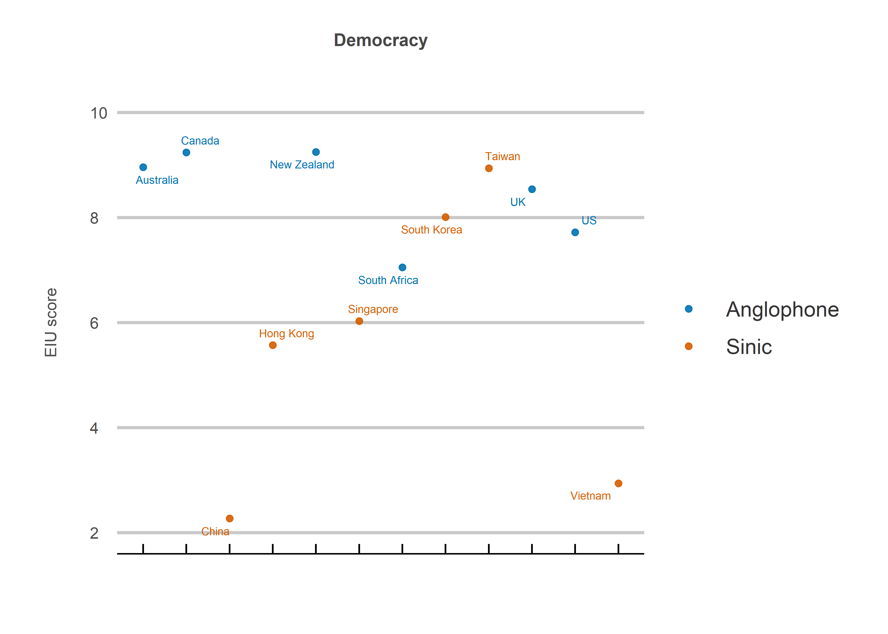
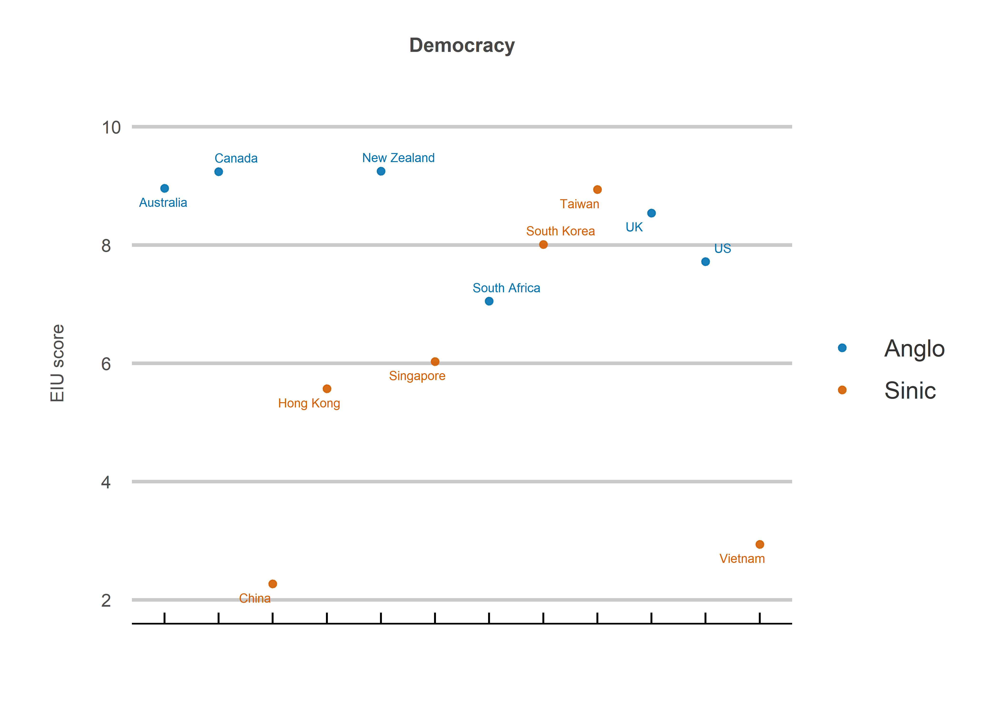
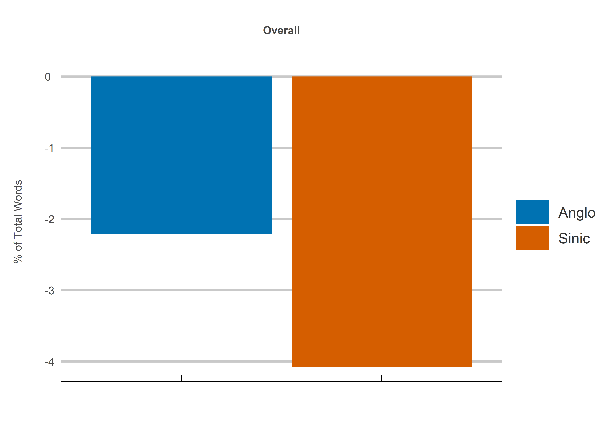
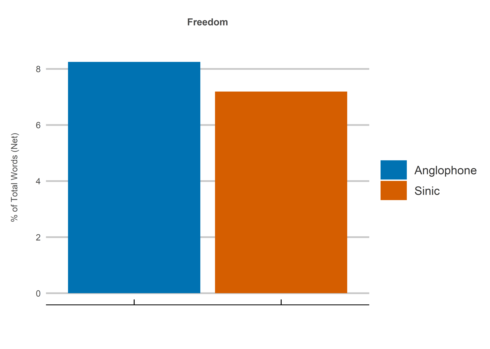
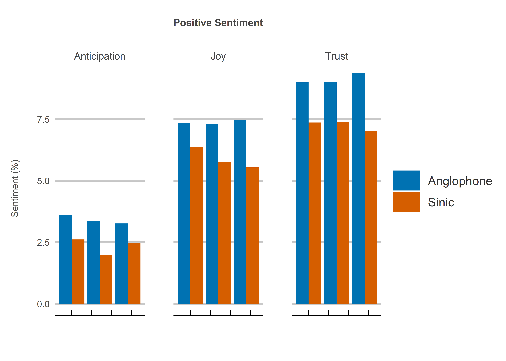
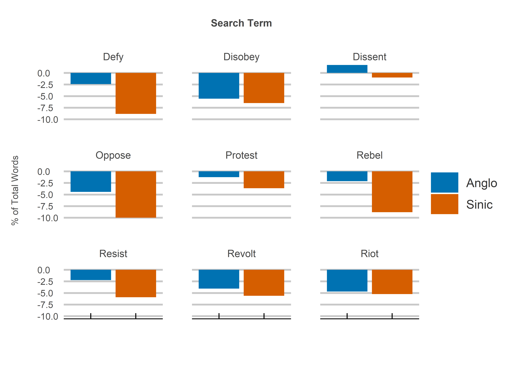
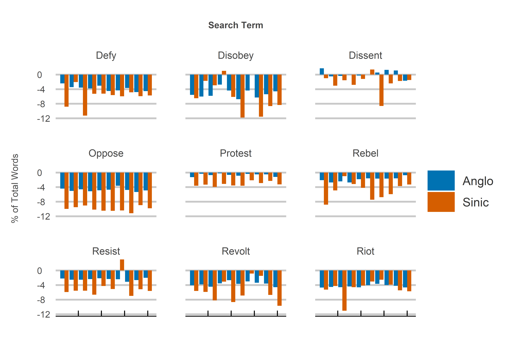
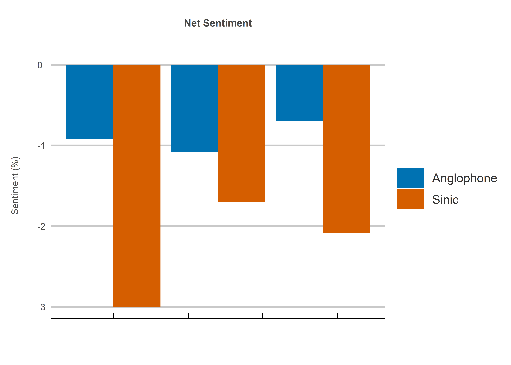

East Asian Authoritarianism?
================
Jack Carter
5/11/2021

## **Summary**

This report analyzes anti-authority sentiment between Anglophone and
Sinic countries. It finds that Sinic country Twitter users demonstrate
less positive sentiment in a collection of tweets containing nine anti-authority words.
This may in part be due to the differing influence of Confucian verses European
enlightenment values in defining attitudes towards individual liberty. 

The rest of the report is organized into the following sections:

1.  Authoritarian Tendencies
2.  Sentiment Analysis

 

## **1: Authoritarian Tendencies**

1.1: Power distance scores according to Hofstede’s seminal cultural
dimension’s study. Power distance is the extent to which people accept
unequal power in society *(Hofstede, 1980)*.

<!-- -->

1.2: Aspects of democracy according to The Economist Intelligence Unit’s
Democracy Index *(EIU, 2020)*.

<!-- -->

 

## **2: Sentiment Analysis**

The tweets are collected within a 50
mile range of Anglophone and Sinic country capitals from 11-05-2021 to
present. A sentiment analysis is then conducted using the NRC sentiment
library. Figures 2.1
and 2.2 show specific emotions while figures 2.3 to 2.5 show net
sentiment (positive minus negative words).

The anti-authority words includes 1) defy, 2) disobey, 3) dissent, 4) oppose,
5) protest, 6) rebel, 7) resist, 8) revolt and 9) riot.

 

### Summary Statistics:

| Region | Tweets (000s) | Tweets (%) |
| :----: | :-----------: | :--------: |
| Anglo  |     56.5      |    35.3    |
| Sinic  |     103.8     |    64.7    |
| Total  |     160.3     |   100.0    |

 

### Emotions:

2.1: Selected positive emotions for tweets containing the anti-authority
words. This is calculated as the number of words for each emotion
expressed as a percentage of total words.

<!-- -->

2.2: Selected negative emotions for tweets containing the anti-authority
words. This is calculated as the number of words for each emotion
expressed as a percentage of total words.

<!-- -->

### Net Sentiment:

2.3: The net sentiment for each region. Net sentiment is calculated as
positive minus negative words expressed as a percentage of total words.

<!-- -->

2.4: The net sentiment for each week during the data collection process.
Net sentiment is calculated as positive minus negative words expressed
as a percentage of total words.

<!-- -->

2.5: The net sentiment for each country. Net sentiment is calculated as
positive minus negative words expressed as a percentage of total words.

<!-- -->

2.6: The net sentiment for each search term. Net sentiment is calculated
as positive minus negative words expressed as a percentage of total
words.

<!-- -->

 

## **Sources**

  - EIU (2020) <https://www.eiu.com/n/campaigns/democracy-index-2020/>

  - Hofstede (1980)
    <https://www.tandfonline.com/doi/abs/10.1080/00208825.1980.11656300?journalCode=mimo20>

  - Mohammad (2021)
    <https://saifmohammad.com/WebPages/NRC-Emotion-Lexicon.htm>

  - Twitter (2021) <https://developer.twitter.com/en/apply-for-access>
