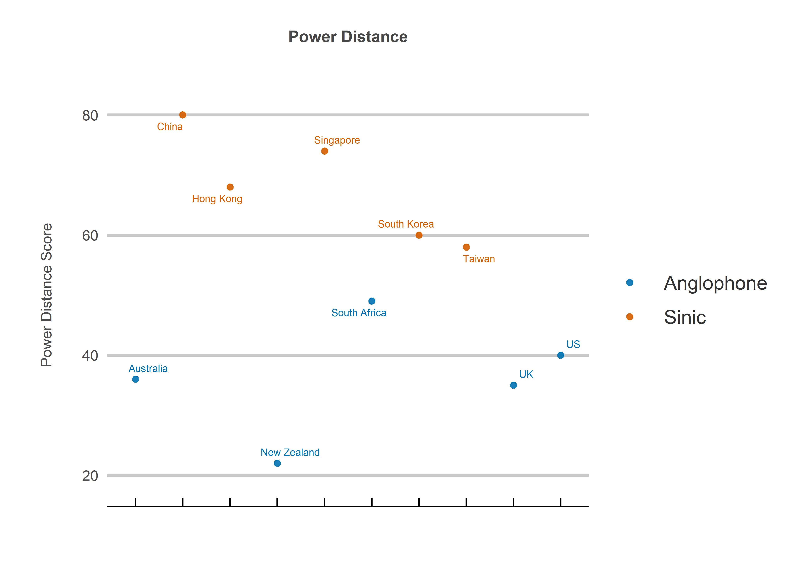
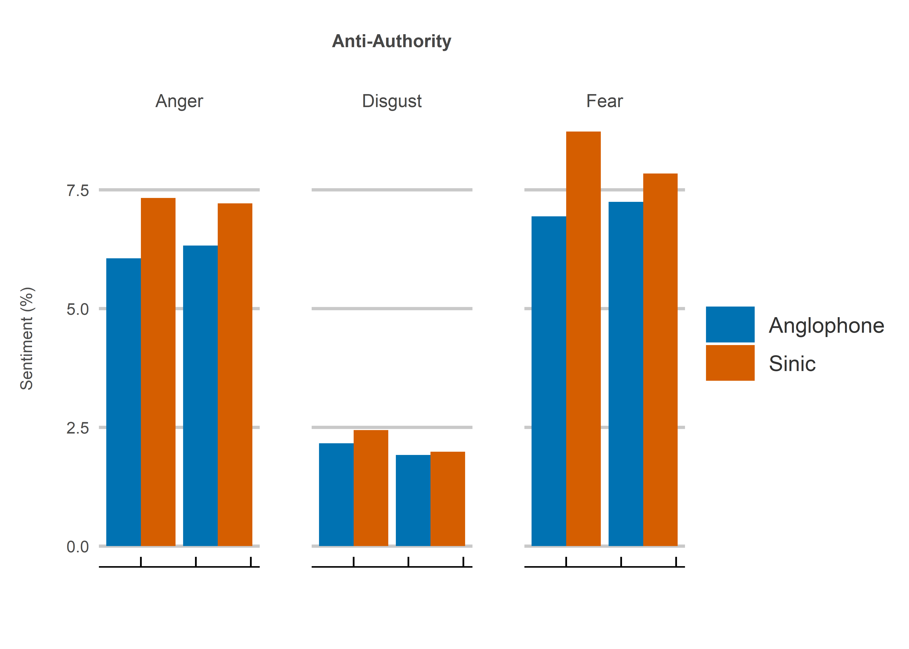
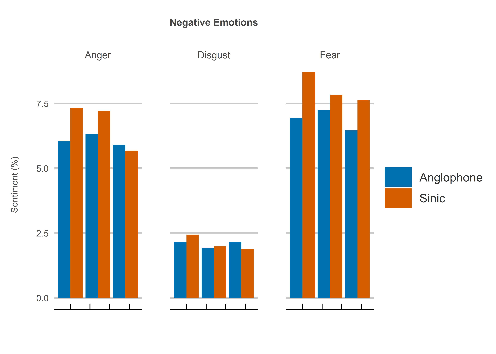

East-Asian-Authoritarianism
================
Jack Carter
4/10/2021

## **Summary**

This report analyzes Authoritarianism between Sinic and Anglophone
countries. It finds that Sinic country Twitter users demonstrate less
positive sentiment when using freedom and a collection of anti-authority
words. This may be due to the differing influence of Confucian verses
European enlightenment values in defining attitudes towards individual
liberty.

It could also however be the result of a difference in situational
context. Many people in Hong Kong and Taiwan for instance likely tweet
negatively about their own freedoms given China’s growing regional
assertiveness. South East Asian countries such as Singapore may also be
more likely to tweet negatively about the tragic loss of freedom in
neighbouring Myanmar following a recent military coup.

The rest of the report is organized into the following sections:

1.  The Current Situation
2.  Twitter: Sentiment Analysis

 

## **1. The Current Situation**

### Democracy:

1.1: Overall democracy scores according to The Economist Intelligence
Unit *(EIU, 2020)*.

<!-- -->

1.2: Aspects of democracy scores according to The Economist Intelligence
Unit *(EIU, 2020)*.

<!-- -->

### Authority:

1.3: Power distance scores, the extent to which people accept unequal
power in society *(Hofstede, 1980)*.

<!-- -->

1.4: Re-election rates for leaders. Note that China and Vietnam are not
democratic while South Korea’s constitution does not allow for
re-election ([see here for details](Re-election_rates.xls)).
<!-- -->

 

## **2. Twitter: Sentiment Analysis**

The analysis collects tweets from within a 50 mile range of the
respective country capitals. A sentiment analysis is conducted using the
NRC lexicon library. This is done by calculating how often words
associated with certain sentiments occur relative to the respective
regional totals. The data are then presented as bar charts with each set
of bars representing a new week beginning on 10th April 2021.

 

### Summary Statistics:

|   Region   | Tweets (000s) | Tweets (%) | Words (000s) | Words (%) |
| :--------: | :-----------: | :--------: | :----------: | :-------: |
| Anglophone |      113      |    52.8    |     2094     |   47.4    |
|   Sinic    |      101      |    47.2    |     2322     |   52.6    |

 

### Freedom:

2.1 The net sentiment for freedom. Net sentiment is calculated as
positive minus negative words.

<!-- -->

2.2 Positive emotions for freedom.

<!-- -->

2.3 Negative emotions for freedom.

<!-- -->

 

### Anti-Authority:

2.4 The net sentiment for anti-authority words (protest, rebel, revolt
and riot). Net sentiment is calculated as positive minus negative words.

<!-- -->

2.5 Positive emotions for anti-authority words (protest, rebel, revolt
and riot).

<!-- -->

2.6 Negative emotions for anti-authority words (protest, rebel, revolt
and riot).

<!-- -->

 

## **Sources**

  - EIU (2020) <https://www.eiu.com/n/campaigns/democracy-index-2020/>

  - Hofstede (1980)
    <https://www.tandfonline.com/doi/abs/10.1080/00208825.1980.11656300?journalCode=mimo20>

  - Mohammad (2021)
    <https://saifmohammad.com/WebPages/NRC-Emotion-Lexicon.htm>

  - Twitter (2021) <https://developer.twitter.com/en/apply-for-access>
