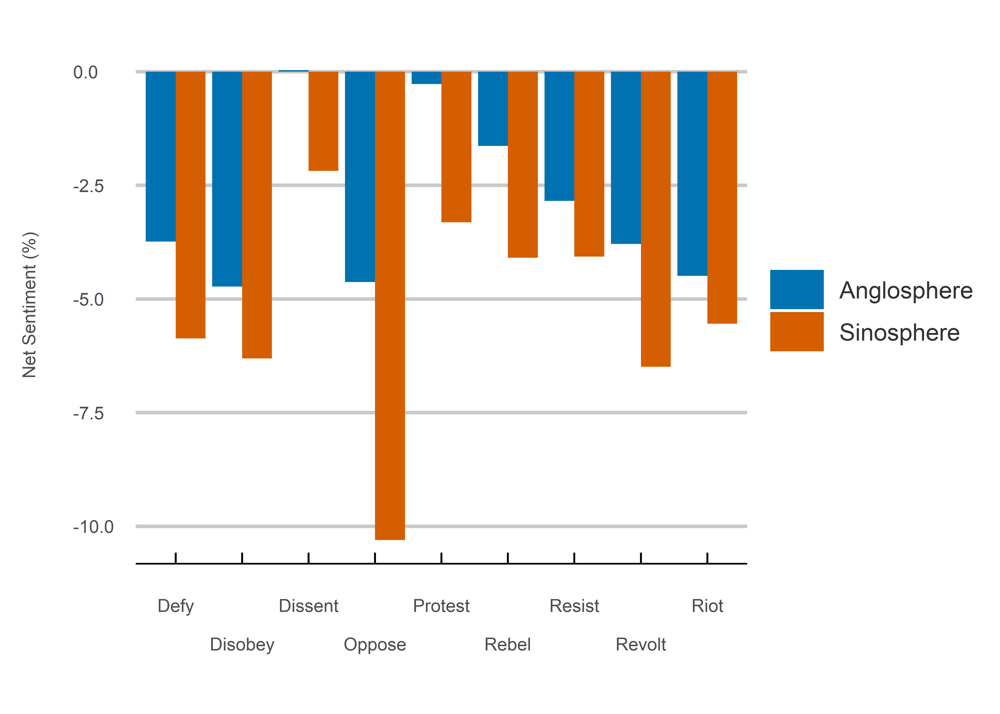
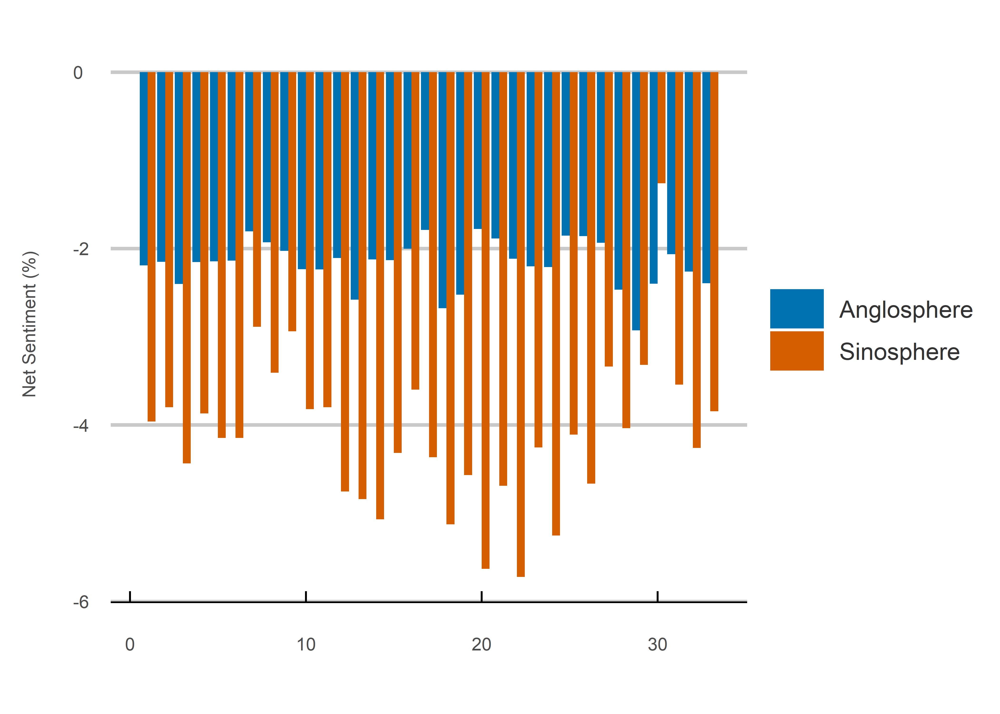

Rebel Without a Cause
================
Jack Carter
13/10/2021

## **Summary**

This project analyzes a corpus of over 1 million tweets containing or in
response to Tweets containing a range of anti-authority words between
Anglosphere and Sinosphere Twitter users. It finds negative sentiment is
significantly higher among Sinosphere users, potentially indicating a
deep rooted cultural difference in attitudes to authority.

 

## **Method**

**1) Search Parameters:**

The anti-authority terms searched for include defy, disobey, dissent,
oppose, protest, rebel, resist, revolt and riot, while the countries
targeted include Australia, Canada, New Zealand, South Africa, the UK,
the US, China, Hong Kong, Singapore, South Korea, Taiwan and Vietnam.

 

**2) Data Collection:**

The tweets are collected using Twitter location data from within a 50
mile range of the respective country capitals every week from the May 11
to December 22, 2021. Following this, the Tweets are cleaned to exclude
duplicates, eliminate stopwords (common words with little sentiment
value) and remove punctuation.

 

**3) Sentiment Calculation:**

Net sentiment is calculated as the total ratio of positive minus
negative words. It is expressed as a percentage of all words according
to the relevant facets (region, country etc.), taking into account
differences in the total number of tweets.

 

## Results

### **1) Region:**

<!-- -->

 

### **2) Country:**

<!-- -->

 

### **3) Search Term:**

<!-- -->

 

### **4) Week Collected:**

<!-- -->

 

 

## **Sources**

  - Mohammad (2021)
    <https://saifmohammad.com/WebPages/NRC-Emotion-Lexicon.htm>

  - Twitter (2021) <https://developer.twitter.com/en/apply-for-access>
