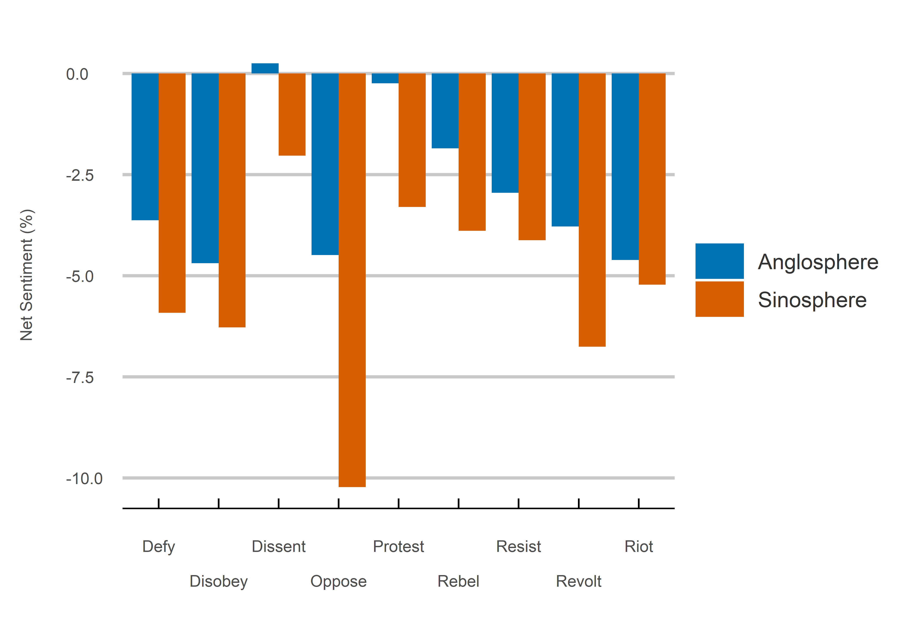

Rebel Without a Cause
================
Jack Carter
13/10/2021

## **Summary**

This project uses sentiment analysis to analyze 1.06 million tweets
containing, or in response to those containing, one of nine
anti-authority words between Anglosphere and Sinosphere Twitter users.
Like James Dean’s character in Rebel Without a Cause, Anglosphere users
appear to view rebellious acts less badly than others.

 

## Results

### **1) Region:**

There is significantly lower net sentiment for Sinosphere
users.

<!-- -->

 

### **2) Search Term:**

There is significantly lower net sentiment among Sinosphere users
for each anti-authority term.

<!-- -->

 

### **3) Country:**

There is lower net sentiment for most Sinosphere countries. It should be noted that although China and Taiwan may show higher net sentmiment, this was based on a comparartively low number of tweets. 

<!-- -->

 

## **Method**

### **1) Choose Terms:**

The terms were chosen by searching for synonyms of protest.

**Tweets (000s)**

<table>

<thead>

<tr>

<th style="text-align:right;">

Defy

</th>

<th style="text-align:right;">

Disobey

</th>

<th style="text-align:right;">

Dissent

</th>

<th style="text-align:right;">

Oppose

</th>

<th style="text-align:right;">

Protest

</th>

<th style="text-align:right;">

Rebel

</th>

<th style="text-align:right;">

Resist

</th>

<th style="text-align:right;">

Revolt

</th>

<th style="text-align:right;">

Riot

</th>

</tr>

</thead>

<tbody>

<tr>

<td style="text-align:right;">

39

</td>

<td style="text-align:right;">

4

</td>

<td style="text-align:right;">

13

</td>

<td style="text-align:right;">

83

</td>

<td style="text-align:right;">

686

</td>

<td style="text-align:right;">

52

</td>

<td style="text-align:right;">

87

</td>

<td style="text-align:right;">

19

</td>

<td style="text-align:right;">

80

</td>

</tr>

</tbody>

</table>

 

### **2) Countries:**

The countries were selected because Anglosphere and Sinosphere
based cultures were thought to be the most different in terms of attitudes
towards authority based on Hoefstede's research into power distance. 

**Tweets (000s)**

<table>

<thead>

<tr>

<th style="text-align:right;">

Australia

</th>

<th style="text-align:right;">

Canada

</th>

<th style="text-align:right;">

China

</th>

<th style="text-align:right;">

Hong Kong

</th>

<th style="text-align:right;">

New Zealand

</th>

<th style="text-align:right;">

Singapore

</th>

<th style="text-align:right;">

South Africa

</th>

<th style="text-align:right;">

South Korea

</th>

<th style="text-align:right;">

Taiwan

</th>

<th style="text-align:right;">

UK

</th>

<th style="text-align:right;">

US

</th>

<th style="text-align:right;">

Vietnam

</th>

</tr>

</thead>

<tbody>

<tr>

<td style="text-align:right;">

3

</td>

<td style="text-align:right;">

11

</td>

<td style="text-align:right;">

1

</td>

<td style="text-align:right;">

22

</td>

<td style="text-align:right;">

4

</td>

<td style="text-align:right;">

507

</td>

<td style="text-align:right;">

37

</td>

<td style="text-align:right;">

36

</td>

<td style="text-align:right;">

1

</td>

<td style="text-align:right;">

231

</td>

<td style="text-align:right;">

210

</td>

<td style="text-align:right;">

1

</td>

</tr>

</tbody>

</table>

 

### **3) Data Collection:**

The tweets were collected from a 50 mile range of the each country capital every week from 11 May to 22 December 2021.

—EXAMPLE CODE SNIPET—

``` r
# searches for tweets with a given search term in a given 
# location using the rtweet search_tweets function. 
get_tweets <- function(search_term, coordinates) {
  search_tweets(
    q = search_term,
    n = 100000,
    include_rts = FALSE,
    retryonratelimit = TRUE,
    lang = "en",
    geocode = coordinates
  )
}
```

 

### **4) Data Cleaning:**

The text is cleaned by removing links and converting all characters to
lowercase.

—EXAMPLE CODE SNIPET—

``` r
# cleans links from the text. 
process_raw_tweet_data <- function(country) {
  pattern <- "https://t.co/[A-Za-z\\d]+|&amp;"
  text <- country %>%
    mutate(text = str_to_lower(str_replace_all(text, pattern, "")))
  return(text)
}
```

 

### **5) Sentiment Analysis:**

A sentiment analysis is calculated by breaking down each tweet into individual words, removing stopwords (common words with little sentiment value) and calculating the percentage of positive minus negative words. 

—EXAMPLE CODE SNIPET—

``` r
# calculates sentiment values faceted by region, search term and sentiment type. 
calculate_search_term_percentages <- function(words) {
  final_value <- words %>%
    group_by(region, search) %>%
    mutate(total_words = sum(words),
           percent = (words / total_words)*100) %>%
    select(region, search, sentiment, percent) %>%
    group_by(region, search, sentiment) %>%
    summarise(percent = sum(percent))
  return(final_value)
}
```

 

## **Sources**

  - Clearly Cultural (2022)
    <https://clearlycultural.com/geert-hofstede-cultural-dimensions/power-distance-index/>

  - Mohammad (2021)
    <https://saifmohammad.com/WebPages/NRC-Emotion-Lexicon.htm>

  - Twitter (2021) <https://developer.twitter.com/en/apply-for-access>
