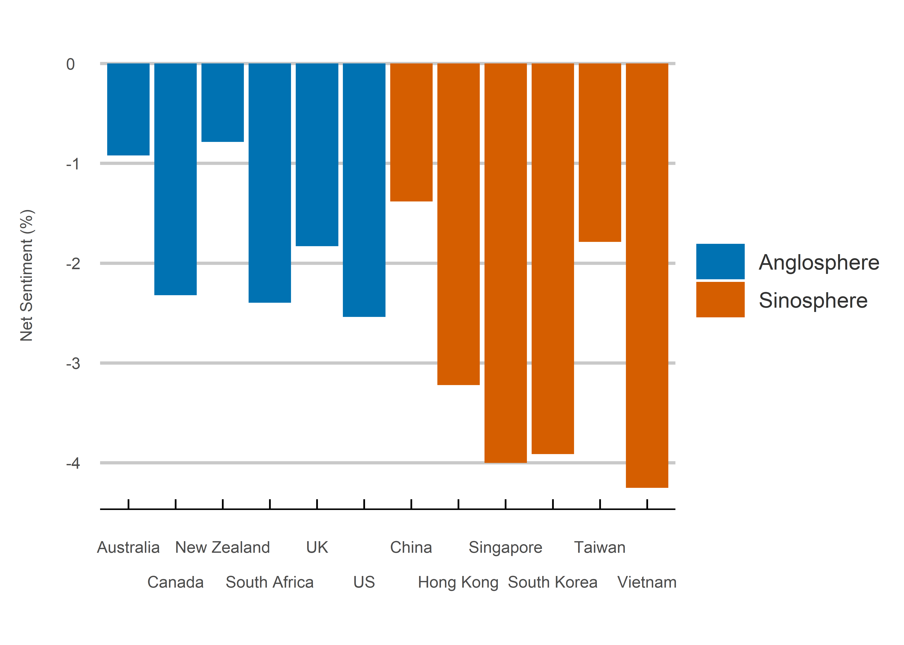

Rebel Without a Cause
================
Jack Carter
13/10/2021

## **Summary**

This project analyzes a corpus of over 900,000 tweets containing, or in
response to tweets containing, a range of different anti-authority words. It aims
to test whether there are systematic differences in anti-authority
sentiment between Anglosphere and Sinosphere Twitter users. It finds
that negative sentiment is significantly higher among Sinosphere users,
potentially indicating a deep rooted cultural difference in attitudes to
authority. These results could also however be due to other factors, 
such as the more limited use of anti-authority words in everyday language 
for those whose mother tongue is not English. 

 

## **Method**

**1) Search Terms:**

The tweets contain or are in response to those containing one or more of
nine anti-authority words, including defy, disobey, dissent, oppose,
protest, rebel, resist, revolt and riot.

 

**2) Countries:**

The Anglosphere countries include Australia, Canada, New Zealand, South
Africa, the UK and the US. The Sinosphere countries include China, Hong
Kong, Singapore, South Korea, Taiwan and Vietnam.

 

**3) Data Collection:**

The tweets are collected using Twitter location data from within a 50
mile range of the respective country capitals every week from the 11th of May to
present. They are then cleaned to exclude duplicates, eliminate stop words (those 
adding no sentiment value) and remove punctuation. 

 

**4) Sentiment Calculation:**

Net sentiment is calculated as the total share of 
positive words minus the total share of negative words. 
It is expressed as a percentage of all words depending 
on the third variable being faceted, taking into account 
differences in the number and length of tweets. 

 

### Results

1. Net sentiment by region.

<!-- -->

2. Net sentiment by week.

<!-- -->

3. Net sentiment by search term.

<!-- -->

4. Net sentiment by country.

<!-- -->

 

## **Sources**

  - Mohammad (2021)
    <https://saifmohammad.com/WebPages/NRC-Emotion-Lexicon.htm>

  - Twitter (2021) <https://developer.twitter.com/en/apply-for-access>
