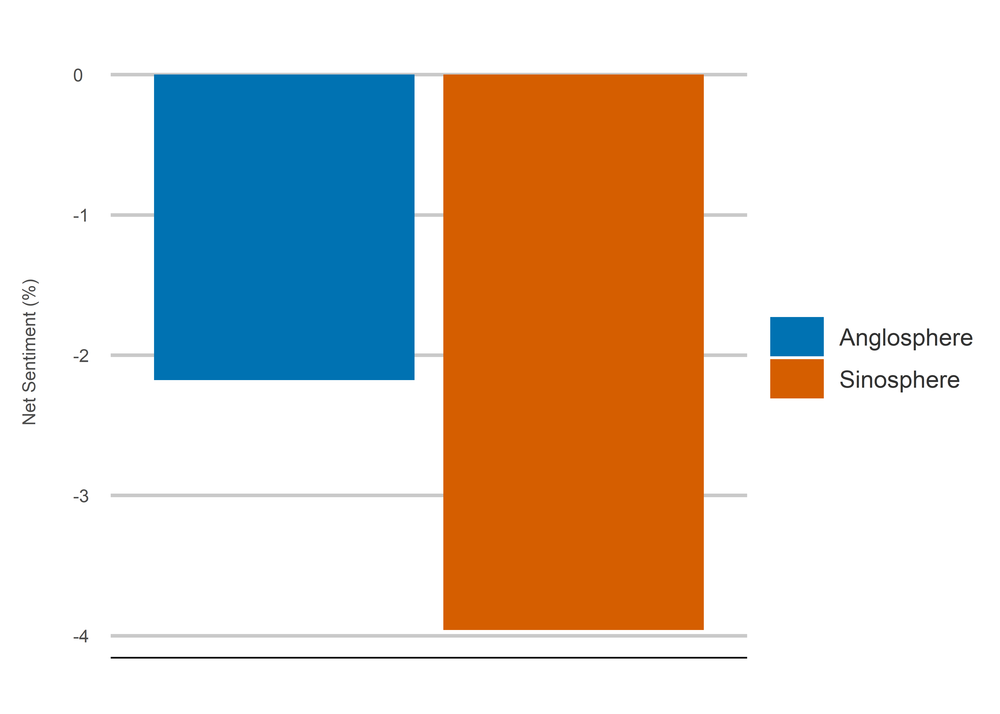

Rebel Without a Cause
================
Jack Carter
13/10/2021

## **Summary**

This project analyzes a corpus of 1.06 million tweets containing nine
anti-authority words between Sinosphere and Anglosphere Twitter users.
It finds that negative sentiment is significantly higher among
Sinosphere users, potentially indicating a deep rooted cultural
difference in attitudes towards authority.

 

## Results

### **1) Region:**

<!-- -->

<br/>

### **2) Search Term:**

<!-- -->

<br/>

### **3) Country:**

<!-- -->

 

## **Method**

### **1) Search Terms:**

The nine anti-authority search terms and their tweet frequencies in
thousands:

<table>

<thead>

<tr>

<th style="text-align:right;">

Defy

</th>

<th style="text-align:right;">

Disobey

</th>

<th style="text-align:right;">

Dissent

</th>

<th style="text-align:right;">

Oppose

</th>

<th style="text-align:right;">

Protest

</th>

<th style="text-align:right;">

Rebel

</th>

<th style="text-align:right;">

Resist

</th>

<th style="text-align:right;">

Revolt

</th>

<th style="text-align:right;">

Riot

</th>

</tr>

</thead>

<tbody>

<tr>

<td style="text-align:right;">

39

</td>

<td style="text-align:right;">

4

</td>

<td style="text-align:right;">

13

</td>

<td style="text-align:right;">

83

</td>

<td style="text-align:right;">

686

</td>

<td style="text-align:right;">

52

</td>

<td style="text-align:right;">

87

</td>

<td style="text-align:right;">

19

</td>

<td style="text-align:right;">

80

</td>

</tr>

</tbody>

</table>

 

### **2) Countries:**

The twelve countries and their tweet frequencies in thousands:

<table>

<thead>

<tr>

<th style="text-align:right;">

Australia

</th>

<th style="text-align:right;">

Canada

</th>

<th style="text-align:right;">

China

</th>

<th style="text-align:right;">

Hong Kong

</th>

<th style="text-align:right;">

New Zealand

</th>

<th style="text-align:right;">

Singapore

</th>

<th style="text-align:right;">

South Africa

</th>

<th style="text-align:right;">

South Korea

</th>

<th style="text-align:right;">

Taiwan

</th>

<th style="text-align:right;">

UK

</th>

<th style="text-align:right;">

US

</th>

<th style="text-align:right;">

Vietnam

</th>

</tr>

</thead>

<tbody>

<tr>

<td style="text-align:right;">

3

</td>

<td style="text-align:right;">

11

</td>

<td style="text-align:right;">

1

</td>

<td style="text-align:right;">

22

</td>

<td style="text-align:right;">

4

</td>

<td style="text-align:right;">

507

</td>

<td style="text-align:right;">

37

</td>

<td style="text-align:right;">

36

</td>

<td style="text-align:right;">

1

</td>

<td style="text-align:right;">

231

</td>

<td style="text-align:right;">

210

</td>

<td style="text-align:right;">

1

</td>

</tr>

</tbody>

</table>

 

### **3) Data Collection:**

The tweets were collected using Twitter location data from within a 50
mile range of the respective country capitals every week from May 11 to
December 22, 2021.

—EXAMPLE CODE SNIPET—

``` r
# collects tweets for each search term and binds the 
# results together into a tibble data frame. 
process_country <- function(country, region, coordinates) {
  searches <- list() 
  for(i in 1:length(search_term)){
    searches[[i+1]] <- process_data(search_term[i], coordinates, country, 
                                    region, date_collected, label[i])
  }
  result <- tibble(rbind_pages(searches))
  return(result)
} 
```

 

### **4) Data Cleaning:**

The text is cleaned to remove links.

—EXAMPLE CODE SNIPET—

``` r
# cleans links from the text. 
process_raw_tweet_data <- function(country) {
  pattern <- "https://t.co/[A-Za-z\\d]+|&amp;"
  text <- country %>%
    mutate(text = str_to_lower(str_replace_all(text, pattern, "")))
  return(text)
}
```

 

### **5) Sentiment Analysis:**

A sentiment analysis is conducted by breaking down each tweet into
individual words (tokens), removing stopwords (common words with little
sentiment value) and calculating the net percentage of positive verses
negative words.

—EXAMPLE CODE SNIPET—

``` r
# calculates sentiment values faceted by region, search term and sentiment type. 
calculate_search_term_percentages <- function(words) {
  final_value <- words %>%
    group_by(region, search) %>%
    mutate(total_words = sum(words),
           percent = (words / total_words)*100) %>%
    select(region, search, sentiment, percent) %>%
    group_by(region, search, sentiment) %>%
    summarise(percent = sum(percent))
  return(final_value)
}
```

 

## **Sources**

  - Mohammad (2021)
    <https://saifmohammad.com/WebPages/NRC-Emotion-Lexicon.htm>

  - Twitter (2021) <https://developer.twitter.com/en/apply-for-access>
